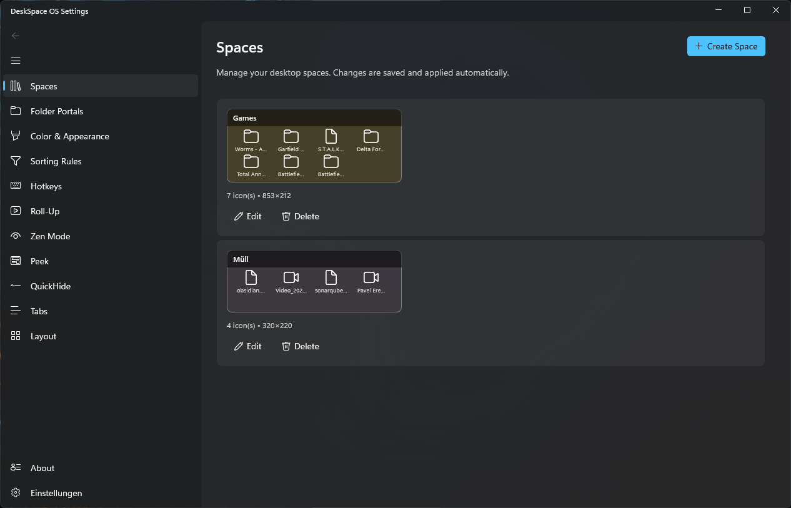
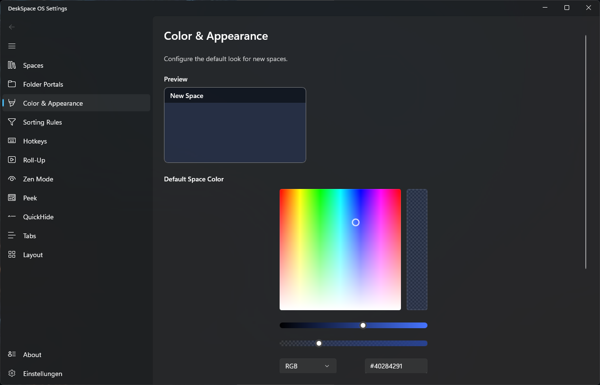
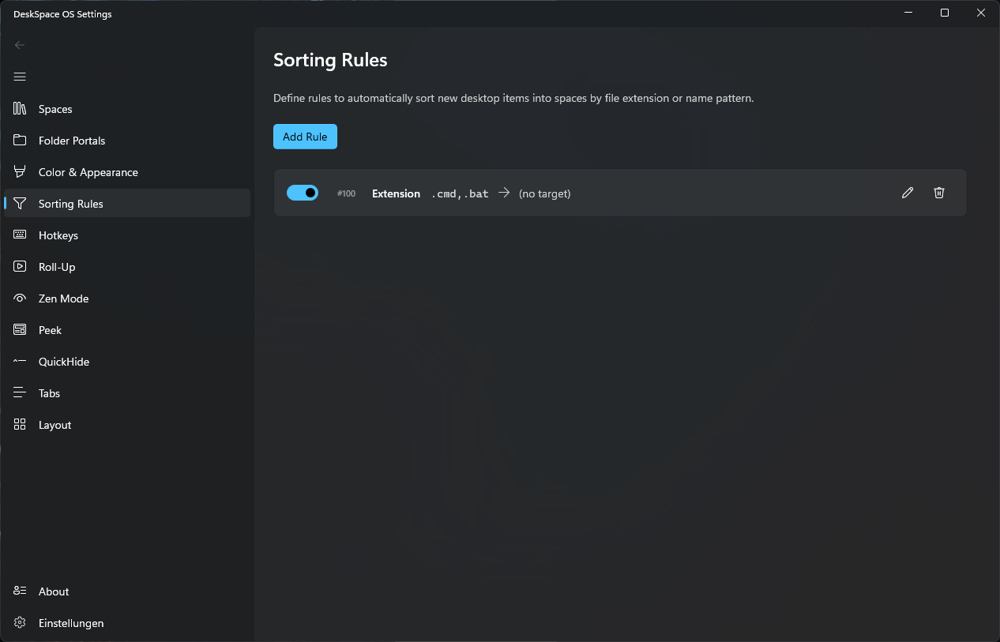
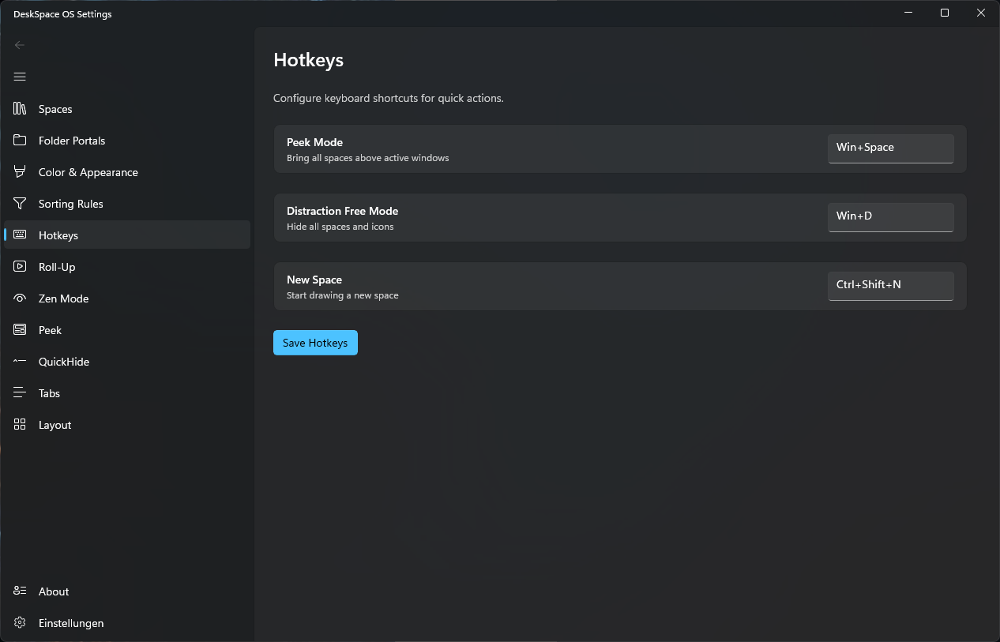
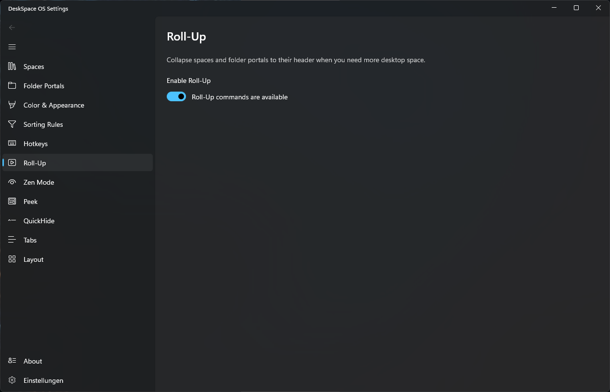
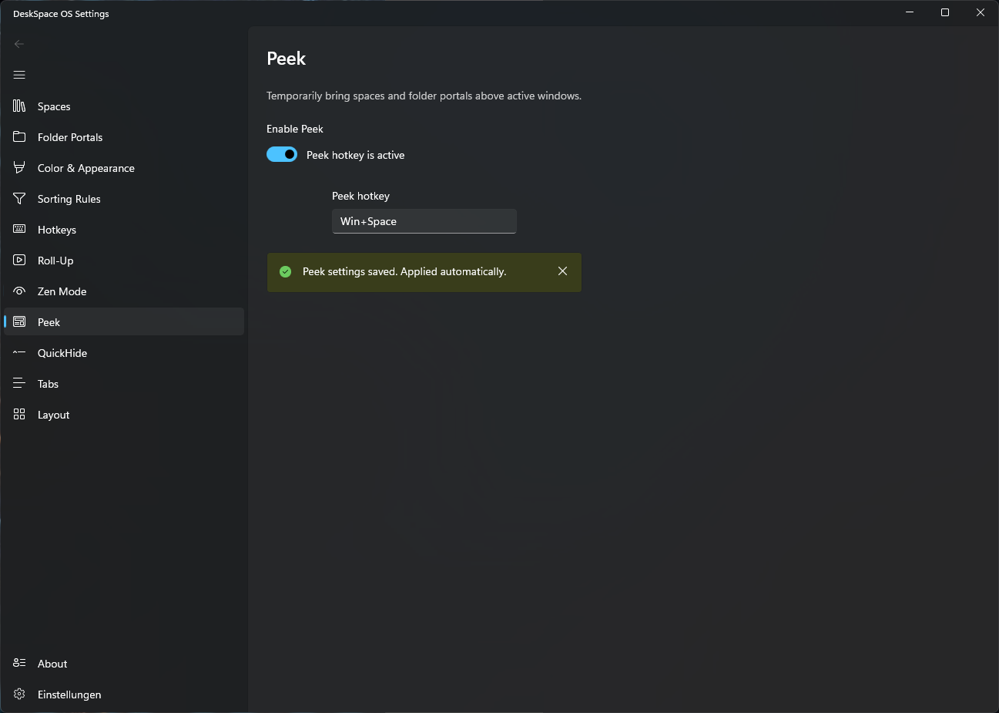

# DeskSpace OS

DeskSpace OS is a powerful and elegant desktop organization utility designed to declutter your workspace and boost your productivity. By grouping your desktop icons, files, and folders into customizable spaces and providing advanced features like folder portals, automatic sorting, and quick-hide functionalities, DeskSpace OS transforms your chaotic desktop into a streamlined workspace.

## 🚀 Features

### 🗂️ Spaces (Spaces)
Group your icons, shortcuts, and files into shaded, resizable areas on your desktop. Keep your workspace organized by categorizing your apps and documents logically.



### 📂 Folder Portals
Mirror the contents of any folder (like your Downloads or Documents) directly onto your desktop as a space. Access deeply nested files instantly without opening a File Explorer window.


### 🎨 Color & Appearance
Fully customize the look and feel of your workspace. Adjust the background color, transparency, blur effects, and label fonts of your spaces to match your wallpaper and personal style.



### ⚡ Sorting Rules
Automate your desktop organization. Create rules to automatically route new files, documents, or shortcuts into designated spaces based on file extensions, name patterns, or creation dates.



### ⌨️ Hotkeys
Navigate and manage your desktop at the speed of thought. Assign custom keyboard shortcuts to trigger actions like hiding icons, switching layouts, or bringing spaces to the front.



### 📜 Roll-Up
Save valuable screen real estate by double-clicking the title bar of a space to "roll it up." The contents are hidden, leaving only the title bar visible until you need them again or hover over them.



### 🧘 Zen Mode
Reduce visual distractions by fading out spaces and desktop icons when they are not actively being used. They gently reappear when you hover your mouse over them or click the desktop.

### 👀 Peek
Instantly bring your desktop spaces on top of all your open windows with a simple hotkey. Access your files and apps quickly without needing to minimize your current work.



### 👻 QuickHide
Double-click any empty space on your desktop to instantly hide all your icons and spaces, revealing your clean wallpaper. Double-click again to bring them all back.

### 📑 Tabs
Combine multiple spaces or folder portals into a single, tabbed interface on your desktop. Perfect for organizing large amounts of files into a compact, easily accessible area.

### 💾 Layout Management
Save snapshots of your desktop layouts. Easily restore your icon and space positions, which is especially useful when docking your laptop or switching between different monitor setups and resolutions.

## 🛠️ Tech Stack

DeskSpace OS is built with modern .NET technologies to ensure high performance and deep Windows integration:
- **Core Library:** .NET 10 (C#) — shared models, storage, and Win32 interop
- **Background Service:** .NET 10 Windows worker service (WPF + Windows Forms) for overlays and shell integration
- **Settings App:** .NET 10 Windows App SDK / WinUI 3 for a native, fluid Windows 11 design experience

Platform is **x64**. The Settings app follows the Windows display language by default and can be switched to English, German, Russian, or Ukrainian. Its About page shows the installed release version and provides a manual update check. Updates are delivered via Velopack: the background service checks once per start and installs a newer version automatically — switch **Check for updates at startup** off in Settings to check only manually.

## 📥 Getting Started

Prerequisites: the .NET 10 SDK and (for the Settings App) Windows Developer Mode enabled.

1. Clone the repository.
2. Open `DeskSpaceOS.slnx` in Visual Studio 2022 (17.13+), or build from the CLI.
3. Build and run from the CLI:
   ```powershell
   dotnet build DeskSpaceOS.slnx -c Debug -p:Platform=x64
   dotnet run --project DeskSpaceOS.Service/DeskSpaceOS.Service.csproj -c Debug -p:Platform=x64
   dotnet run --project DeskSpaceOS.SettingsApp/DeskSpaceOS.SettingsApp.csproj -c Debug -p:Platform=x64
   ```
   Or use the root helpers `run-service.bat` and `run-settings.bat`.

## 🤝 Contributing

Contributions are welcome! Feel free to open issues or submit pull requests.

## 📄 License

*(Add your license information here, e.g., MIT License)*
